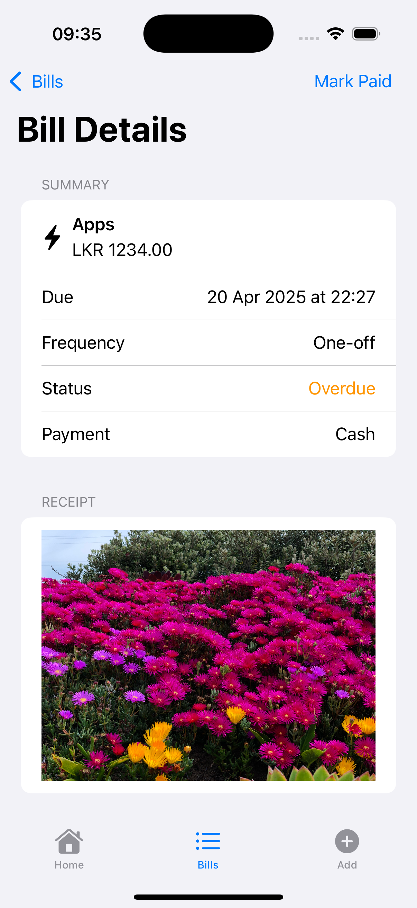

# billMind
# Student Id – IT21167300
# Student Name – Pasindu Dinal

#### 01. Brief Description of Project
**billMind** is an iOS expense‑tracking app built in SwiftUI & SwiftData. It lets you add one‑off or recurring bills (name, due date, amount, category, payment mode), attach receipt photos, and get local notification reminders. A Home dashboard shows total unpaid, category‑breakdown chart and overdue count; Bills list lets you swipe to delete or tap to mark paid/unpaid; Detail view shows full bill info, lets you add a receipt or spawn the next occurrence of a recurring bill.

#### 02. Users of the System
- Individuals who want a simple, local‑only way to track and be reminded about upcoming bills.
- Users who prefer a SwiftUI‑native experience with no backend setup.

#### 03. What is Unique About Your Solution
- **SwiftData + SwiftUI** only: no Core Data boilerplate or server backend.
- **Recurring‑bill engine**: mark a recurring bill as paid and a new one spawns automatically.
- **Local notifications** scheduled per‑bill, cancelled on delete or payment.
- **Receipt photos** via SwiftUI `PhotosPicker` stored right in SwiftData.
- **Home dashboard** with a live bar chart (`Charts`) and overdue banner.

#### 04. Functionality of the Screens
1. **Home (Overview)**
    - Shows "Unpaid total" card with formatted sum.
    - "By category" bar chart of unpaid bills.
    - Overdue banner if any bills are past due.  
      
2. **Bills List**
    - Lists all bills (or only paid with the toolbar toggle).
    - Swipe‑to‑delete removes the bill and its pending notification.
    - Tap a row to view details.  
      
3. **Add Bill**
    - Form fields for name, amount, date & time.
    - Pickers for category, payment mode, and repeat frequency.
    - Optional receipt photo picker.
    - "Save" inserts into SwiftData and schedules a notification.  
      
4. **Bill Details**
    - Summary of all bill fields, status & next occurrence for recurring.
    - "Mark Paid/Unpay" button toggles payment, cancels or reschedules notifications, and if recurring spawns the next instance.
    - Add receipt photo here if missing.  
      

#### 05. Best Practices Used When Writing Code
- **Separation of concerns**: split models, views, notification logic into separate files.
- **Property wrappers** (`@Model`, `@Query`, `@Bindable`) for concise state & persistence.
- **Explicit `init()` for views with `@Query`** to expose a public zero‑arg initializer.
- **Computed properties** for `isOverdue`, `frequency`, `category.symbol` to keep UI code clean.
- **Safe optionals** in model to avoid SwiftData migration crashes (`frequencyRaw: Frequency? = .none`).
- **Consistent naming** (camelCase, descriptive variable names) and formatting (SwiftLint‑style).

```swift
struct BillRowView: View {
    let bill: Bill
    var body: some View {
        HStack {
            Image(systemName: bill.category.symbol)
                .foregroundColor(.accentColor)
            VStack(alignment: .leading) {
                Text(bill.name)
                    .font(.headline)
                Text("LKR \(String(format: "%.2f", bill.amount)) · \(bill.date, formatter: dateFormatter)")
                    .font(.subheadline)
                    .foregroundStyle(.secondary)
            }
            Spacer()
            if bill.isPaid {
                Image(systemName: "checkmark.circle.fill")
                    .foregroundColor(.green)
            } else if bill.isOverdue {
                Image(systemName: "exclamationmark.triangle.fill")
                    .foregroundColor(.orange)
            }
        }
    }
}
```

#### 06. UI Components Used

- SwiftUI: TabView, NavigationStack, Form, List, Section, TextField, DatePicker, Picker, Toggle, Button, Image

- SwiftData: @Model, @Query, ModelContainer, FetchDescriptor

- PhotosUI: PhotosPicker for receipt attachment

- UserNotifications: UNUserNotificationCenter for local reminders

- Charts: Chart, BarMark, AxisMarks for the category breakdown

##### 07. Testing Carried Out

- Unit Tests (BillTests.swift)

- nextDate() correctness for all frequencies.

- isOverdue logic for past/future dates and paid/unpaid.

- In‑memory SwiftData insert & fetch.

- UI Tests (billMindUITests.swift & BillMindUITestsLaunchTests.swift)

- Smoke‐test app launch to Home dashboard.

- "Add → Save → List" flow: enters name & amount, taps Save, verifies in Bills list.

##### 08. Documentation

1. Design Choices

- Chose SwiftData over Core Data for zero‑boilerplate persistence.

- SwiftUI for declarative UI, easy state‐driven updates.

2. Implementation Decisions

- Made frequencyRaw optional with default to handle in‑dev schema evolution.

- Used explicit init() in views with @Query to avoid private initializer traps.

- Separated each view into its own file for clarity and compile order.

3. Challenges

- Debugging SwiftData key‑path crashes when adding a non‑optional property.

- Resolving "initializer inaccessible" errors due to property wrappers.

- Getting the Charts API to infer the correct ID for tuple data.

#### 09. Reflection

- Major hurdles were SwiftData migrations and view initializer quirks—solved with optionals & explicit init().

- Next time, I'd start with the data model and tests first, then scaffold each screen file to avoid large refactors.

- Learned the importance of small, iterative commits and in‑memory testing to catch persistence issues early.

#### 10. macOS (Mac Catalyst) Experience

billMind also ships as a Mac Catalyst build so you can manage your bills right from your Mac.

- **Same SwiftData store**, synchronized via iCloud, so your data is instantly available across iPhone, iPad and Mac.
- **Multi-window & resizable UI**: open multiple bill detail windows, use split-screen or Stage Manager.
- **Drag-&-drop receipt OCR**: the `ReceiptScannerView` accepts images or PDFs dropped onto the window, runs Vision text recognition, then lets you create a bill from the extracted values.
- **Keyboard shortcuts & menus**: ⌘N to add a new bill, ⌘F to search, standard Edit menu for undo/redo.
- **Native sidebar & toolbar** with Mac style icons and a collapsible sidebar for navigation.
- Tested via the `ReceiptScannerMacTests` compile-time suite to ensure all Mac-only views build and instantiate correctly.

  
  

> Note: Real-time camera scanning (iOS) is replaced with drag-and-drop on macOS because Macs do not ship with a rear document camera.

#### 11. watchOS Companion App

A lightweight watchOS app brings the most common bill actions to your wrist.

- **Glanceable Bills list**: shows upcoming bills with name, due date and amount.
- **Quick Add**: `AddBillViewWatch` lets you jot down a name, amount and due date in just three fields and save with one tap.
- **Mark Paid/Unpaid**: from `BillDetailWatchView` you can toggle payment status while in line at the checkout.
- **Notifications tap-through**: tapping a due notification on Apple Watch opens the corresponding bill in the Watch app.
- Built entirely with SwiftUI for watchOS using `NavigationStack`, `List`, `Form` and the new 45-point button sizes.
- Uses **@Model** & **@Query** on the shared SwiftData container via App Groups, so changes propagate back to the phone instantly.

  
  

These two additional targets round out billMind's multi-device story—track expenses on iPhone, scan receipts on Mac and stay on top of due dates from your wrist.